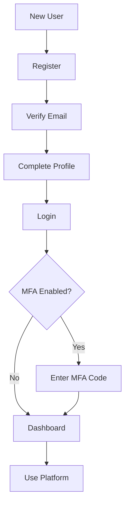

# Product Requirements Document (PRD) - User Module

**Module**: User
**Version**: 1.0
**Status**: Draft
**Last Updated**: 2026-03-12
**Author**: Product Team

---

## Document Control

| Version | Date | Author | Changes |
|---------|------|--------|---------|
| 1.0 | 2026-03-12 | Product Team | Initial draft |

---

## 1. Executive Summary

### 1.1 Problem Statement
> User management is fundamental to any application, encompassing authentication, authorization, profiles, roles, and permissions. Without a centralized user management module, each module implements its own user handling, leading to security vulnerabilities, inconsistent UX, duplicated effort, and compliance risks. The platform needs a comprehensive user management system to handle authentication, authorization, profiles, and user-related operations consistently and securely.

### 1.2 Proposed Solution
> The User module provides complete user lifecycle management including registration, authentication (email, social, SSO), authorization (roles, permissions), profile management, user settings, session management, password recovery, email verification, and integration with all modules requiring user context. It implements industry-standard security practices, supports multi-factor authentication, and ensures GDPR compliance for user data.

### 1.3 Business Value Proposition
- **Primary Value**: Secure, scalable user management foundation for the platform
- **Secondary Value**: Improved user experience, reduced security risk, compliance
- **Strategic Alignment**: User acquisition, retention, security, compliance

### 1.4 Success Metrics (High-Level)
| Metric | Current | Target | Timeline |
|--------|---------|--------|----------|
| Registration Conversion | N/A | 60%+ | Q3 2026 |
| Authentication Success | N/A | 99.9% | Q2 2026 |
| MFA Adoption | N/A | 30%+ | Q3 2026 |
| User Satisfaction | N/A | 4.5/5 | Q3 2026 |

---

## 2. Goals & Objectives

### 2.1 Primary Goals (SMART)
1. **Specific**: Build comprehensive user management with auth, profiles, and authorization
2. **Measurable**: Achieve 99.9% auth success, 60%+ registration conversion
3. **Achievable**: Leverage Laravel Auth, Filament admin, existing infrastructure
4. **Relevant**: Critical for all platform functionality requiring user context
5. **Time-bound**: Core user system by Q2 2026, advanced features by Q3 2026

### 2.2 Secondary Goals
- Implement social authentication (Google, GitHub, etc.)
- Build user onboarding flow
- Create user analytics and insights
- Develop account recovery automation

### 2.3 Non-Goals
> What this module will NOT do (scope boundaries)
- Enterprise SSO/SAML (use dedicated identity providers)
- Customer identity (CIAM) at enterprise scale
- Employee HR management

### 2.4 Key Results (OKRs)
| Objective | Key Result | Target | Status |
|-----------|------------|--------|--------|
| User Excellence | Registered users | 1000+ | Pending |
| Security | MFA adoption | 30%+ | Pending |
| Authentication | Auth success rate | 99.9% | Pending |
| Satisfaction | User satisfaction | 4.5/5 | Pending |

---

## 3. Target Users

### 3.1 User Personas

#### Persona 1: New User
| Attribute | Details |
|-----------|---------|
| Role | Platform Registrant |
| Goals | Create account, get started quickly |
| Pain Points | Complex signup, email delays |
| Technical Level | Basic |
| Usage Frequency | Daily (initially) |

**User Story**:
> As a New User, I want to create an account easily and start using the platform, so that I can access features without friction.

#### Persona 2: Regular User
| Attribute | Details |
|-----------|---------|
| Role | Platform User |
| Goals | Access account, manage settings, stay secure |
| Pain Points | Forgot password, confusing settings |
| Technical Level | Intermediate |
| Usage Frequency | Daily |

**User Story**:
> As a Regular User, I want to manage my profile and security settings easily, so that I can control my account and stay protected.

#### Persona 3: Administrator
| Attribute | Details |
|-----------|---------|
| Role | Platform Admin |
| Goals | Manage users, roles, permissions |
| Pain Points | Manual user management, limited visibility |
| Technical Level | Advanced |
| Usage Frequency | Daily |

**User Story**:
> As an Administrator, I want to manage users and permissions efficiently, so that I can maintain platform security and access control.

### 3.2 Use Cases
| ID | Use Case | Actor | Trigger | Outcome |
|----|----------|-------|---------|---------|
| UC-001 | Register account | New User | Sign up | Account created |
| UC-002 | Login | User | Access platform | Authenticated |
| UC-003 | Reset password | User | Forgot password | Password reset |
| UC-004 | Update profile | User | Profile change | Profile updated |
| UC-005 | Manage roles | Admin | Access change | Role assigned |
| UC-006 | Enable MFA | User | Security setting | MFA enabled |

### 3.3 Pain Points Addressed
| Pain Point | Severity | How Solved |
|------------|----------|------------|
| Complex registration | High | Streamlined signup flow |
| Password management | High | Self-service reset |
| Limited profile control | Medium | Comprehensive settings |
| Security concerns | High | MFA, session management |

---

## 4. Functional Requirements

### 4.1 Requirements Matrix

| ID | Requirement | Description | Priority | Acceptance Criteria |
|----|-------------|-------------|----------|---------------------|
| FR-001 | User Registration | Account creation | P0 | Email verification |
| FR-002 | Authentication | Login/logout | P0 | Secure auth |
| FR-003 | Password Management | Reset, change | P0 | Self-service |
| FR-004 | Profile Management | User profile CRUD | P0 | Profile editing |
| FR-005 | Role Management | User roles | P1 | RBAC system |
| FR-006 | Permission System | Granular permissions | P1 | Permission checks |
| FR-007 | MFA | Multi-factor auth | P1 | TOTP support |
| FR-008 | Session Management | Active sessions | P1 | Session control |
| FR-009 | Email Verification | Verify email addresses | P0 | Verification flow |
| FR-010 | Social Auth | Google, GitHub login | P2 | OAuth integration |
| FR-011 | User Settings | Preferences | P1 | Settings panel |
| FR-012 | Admin User Mgmt | Admin user management | P1 | Admin interface |

### 4.2 Priority Definitions
- **P0 (Critical)**: Must have for launch - registration, auth, profiles
- **P1 (High)**: Should have - roles, permissions, MFA, sessions
- **P2 (Medium)**: Nice to have - social auth, advanced features
- **P3 (Low)**: Future consideration - SSO, enterprise features

### 4.3 Feature Details

#### Feature 1: User Registration
**Description**: Streamlined user registration with email verification and onboarding.

**User Flow**:
```
1. User clicks "Sign Up"
2. Enters email, password, name
3. Submits registration form
4. Verification email sent
5. User clicks verification link
6. Account activated
7. Welcome onboarding shown
```

**Acceptance Criteria**:
- [ ] Email/password registration
- [ ] Email verification required
- [ ] Password strength validation
- [ ] Duplicate email prevention
- [ ] Welcome email
- [ ] Onboarding flow

**Dependencies**: Email System, Activity Module

#### Feature 2: Authentication System
**Description**: Secure authentication with session management and MFA support.

**Acceptance Criteria**:
- [ ] Email/password login
- [ ] Remember me functionality
- [ ] Logout (all sessions)
- [ ] MFA with TOTP
- [ ] Session listing
- [ ] Session termination
- [ ] Login attempt limiting

**Dependencies**: Email System, Notify Module

#### Feature 3: User Profile
**Description**: Comprehensive user profile management with avatar, bio, and settings.

**Acceptance Criteria**:
- [ ] Profile editing
- [ ] Avatar upload
- [ ] Bio/description
- [ ] Privacy settings
- [ ] Notification preferences
- [ ] Account deletion

**Dependencies**: Media Module, Notify Module

---

## 5. Non-Functional Requirements

### 5.1 Performance Requirements
| Metric | Requirement | Measurement |
|--------|-------------|-------------|
| Login Response | <500ms | Auth completion |
| Registration | <1s | Account creation |
| Profile Load | <200ms | Profile display |
| Session Check | <50ms | Per request |
| Availability | 99.9% | Monthly uptime |

### 5.2 Security Requirements
- [x] Password hashing (bcrypt/argon2)
- [x] CSRF protection
- [x] Rate limiting on auth
- [x] Session security
- [x] MFA support
- [x] Account lockout
- [x] Audit logging

### 5.3 Scalability Requirements
- Support for 100,000+ users
- Efficient session storage
- Horizontal auth scaling
- Database optimization

### 5.4 Compliance Requirements
- [x] GDPR (user data, deletion)
- [x] Password security standards
- [x] Privacy policy compliance
- [x] Age verification (if required)

---

## 6. User Experience

### 6.1 User Flows


### 6.2 Wireframes
> [Links to Figma/Sketch wireframes - to be created]

### 6.3 Design Principles
- Simple, intuitive forms
- Clear error messages
- Accessible authentication
- Mobile-responsive

### 6.4 Interaction Specifications
| Interaction | Behavior | Feedback |
|-------------|----------|----------|
| Register | Submit form | Verification email |
| Login | Submit credentials | Dashboard redirect |
| Reset Password | Request reset | Email sent |
| Enable MFA | Scan QR code | MFA activated |

---

## 7. Technical Considerations

### 7.1 Architecture Overview
```
┌─────────────────────────────────────────────────────────┐
│                   User Module                           │
│  ┌──────────────┐  ┌──────────────┐  ┌──────────────┐  │
│  │ Registration │  │ Authentication│  │ Profile      │  │
│  │ System       │  │ System       │  │ Management   │  │
│  └──────────────┘  └──────────────┘  └──────────────┘  │
│  ┌──────────────┐  ┌──────────────┐  ┌──────────────┐  │
│  │ Role/Permission│  │ Session     │  │ MFA         │  │
│  │ System       │  │ Management   │  │ System      │  │
│  └──────────────┘  └──────────────┘  └──────────────┘  │
└─────────────────────────────────────────────────────────┘
              │              │              │
              ▼              ▼              ▼
    ┌─────────────┐ ┌─────────────┐ ┌─────────────┐
    │    Email    │ │   Redis     │ │   Media     │
    │   System    │ │  Sessions   │ │   Module    │
    └─────────────┘ └─────────────┘ └─────────────┘
```

### 7.2 Dependencies
| Dependency | Type | Version | Criticality |
|------------|------|---------|-------------|
| Laravel | Framework | 12.x | Critical |
| Filament | UI Framework | 5.x | High |
| Laravel Breeze/Jetstream | Starter | 2.x | High |
| spatie/laravel-permission | Package | 6.x | Medium |

### 7.3 Integration Points
| System | Integration Type | Data Flow | Frequency |
|--------|------------------|-----------|-----------|
| All Modules | User Context | Inbound | Per request |
| Email System | Verification | Outbound | Per registration |
| Media Module | Avatars | Inbound | Per upload |
| Activity Module | Audit Trail | Outbound | Per action |
| Gdpr Module | Compliance | Bidirectional | Per request |

### 7.4 Technical Constraints
- PHP 8.3+ required
- Laravel 12+ required
- Filament v5 compatibility
- Database: MySQL 8.0+

### 7.5 Database Schema
```sql
CREATE TABLE users (
    id BIGINT UNSIGNED AUTO_INCREMENT PRIMARY KEY,
    name VARCHAR(255),
    email VARCHAR(255) UNIQUE,
    email_verified_at TIMESTAMP NULL,
    password VARCHAR(255),
    avatar_path VARCHAR(500),
    bio TEXT,
    two_factor_secret TEXT,
    two_factor_recovery_codes TEXT,
    remember_token VARCHAR(100),
    created_at TIMESTAMP DEFAULT CURRENT_TIMESTAMP,
    updated_at TIMESTAMP DEFAULT CURRENT_TIMESTAMP ON UPDATE CURRENT_TIMESTAMP,
    
    INDEX idx_email (email)
);

CREATE TABLE roles (
    id BIGINT UNSIGNED AUTO_INCREMENT PRIMARY KEY,
    name VARCHAR(100) UNIQUE,
    guard_name VARCHAR(50),
    created_at TIMESTAMP DEFAULT CURRENT_TIMESTAMP,
    updated_at TIMESTAMP DEFAULT CURRENT_TIMESTAMP ON UPDATE CURRENT_TIMESTAMP
);

CREATE TABLE permissions (
    id BIGINT UNSIGNED AUTO_INCREMENT PRIMARY KEY,
    name VARCHAR(100) UNIQUE,
    guard_name VARCHAR(50),
    created_at TIMESTAMP DEFAULT CURRENT_TIMESTAMP,
    updated_at TIMESTAMP DEFAULT CURRENT_TIMESTAMP ON UPDATE CURRENT_TIMESTAMP
);

CREATE TABLE model_has_roles (
    role_id BIGINT UNSIGNED,
    model_type VARCHAR(255),
    model_id BIGINT UNSIGNED,
    PRIMARY KEY (role_id, model_id, model_type)
);

CREATE TABLE model_has_permissions (
    permission_id BIGINT UNSIGNED,
    model_type VARCHAR(255),
    model_id BIGINT UNSIGNED,
    PRIMARY KEY (permission_id, model_id, model_type)
);

CREATE TABLE sessions (
    id VARCHAR(255) PRIMARY KEY,
    user_id BIGINT UNSIGNED NULL,
    ip_address VARCHAR(45) NULL,
    user_agent TEXT,
    payload LONGTEXT,
    last_activity INT,
    
    INDEX idx_user (user_id),
    INDEX idx_last_activity (last_activity)
);
```

---

## 8. Analytics & Metrics

### 8.1 Success Metrics (KPIs)
| KPI | Definition | Target | Measurement Method |
|-----|------------|--------|-------------------|
| Registration Rate | % visitors who register | 60%+ | Analytics |
| Auth Success | % successful logins | 99.9% | Auth logs |
| MFA Adoption | % users with MFA | 30%+ | User audit |
| User Retention | 30-day retention | 50%+ | Cohort analysis |

### 8.2 Tracking Requirements
- Registration funnel metrics
- Login success/failure rates
- Password reset usage
- MFA adoption rates
- Session analytics

### 8.3 Reporting Dashboards
- User growth overview
- Authentication metrics
- User activity summary
- Admin user management

---

## 9. Timeline & Milestones

### 9.1 Key Dates
| Milestone | Date | Status |
|-----------|------|--------|
| Requirements Complete | 2026-03-12 | Complete |
| Design Complete | 2026-03-26 | Pending |
| Development Start | 2026-03-27 | Pending |
| Core Features (P0) | 2026-04-17 | Pending |
| Beta Launch | 2026-04-24 | Pending |
| GA Launch | 2026-05-08 | Pending |

---

## 10. Open Questions

| ID | Question | Owner | Due Date | Status |
|----|----------|-------|----------|--------|
| Q-001 | Which social providers should we support? | Product | 2026-03-25 | Open |
| Q-002 | Should MFA be required for admins? | Security | 2026-03-20 | Open |
| Q-003 | What is the password complexity requirement? | Security | 2026-03-20 | Open |

---

## 11. Appendix

### 11.1 Glossary
| Term | Definition |
|------|------------|
| MFA | Multi-Factor Authentication |
| TOTP | Time-based One-Time Password |
| RBAC | Role-Based Access Control |
| Session | User authentication state |
| OAuth | Open Authorization protocol |

### 11.2 References
- [Laravel Authentication](https://laravel.com/docs/authentication)
- [Laravel Breeze](https://laravel.com/docs/starter-kits)
- [Spatie Permission](https://spatie.be/docs/laravel-permission)

### 11.3 Related PRDs
- [Gdpr Module PRD](../Gdpr/docs/PRD.md)
- [Activity Module PRD](../Activity/docs/PRD.md)
- [Notify Module PRD](../Notify/docs/PRD.md)
- [Media Module PRD](../Media/docs/PRD.md)
- [Tenant Module PRD](../Tenant/docs/PRD.md)

---

## Approval

| Role | Name | Signature | Date |
|------|------|-----------|------|
| Product Manager | | | |
| Engineering Lead | | | |
| Design Lead | | | |
| Security Lead | | | |
| Stakeholder | | | |
