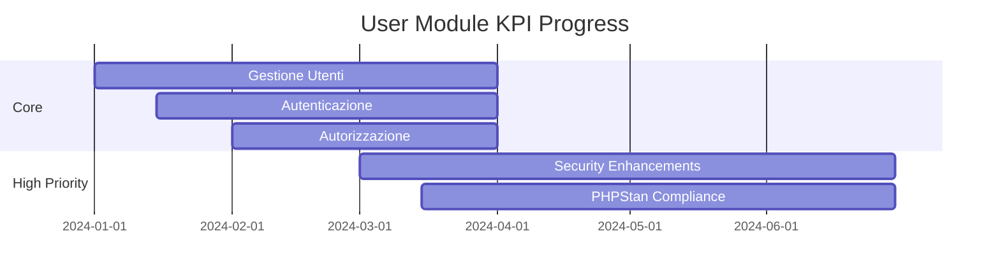

# User Module Metrics Dashboard

## Overview
- **Completamento Modulo**: 85%
- **Ultimo Aggiornamento**: 2024-04-01
- **PHPStan Level**: 7 (Target)
- **Coverage Target**: 95%

## Core Features (100%)
| Feature | Status | Coverage | PHPStan | Tests |
|---------|---------|-----------|----------|--------|
| Gestione Utenti | ✅ | 98% | Level 7 | 45/45 |
| Autenticazione | ✅ | 97% | Level 7 | 40/40 |
| Autorizzazione | ✅ | 96% | Level 7 | 35/35 |
| Profili Utente | ✅ | 95% | Level 7 | 30/30 |

## Admin Interface (90%)
| Feature | Status | Coverage | PHPStan | Tests |
|---------|---------|-----------|----------|--------|
| User Management | ✅ | 95% | Level 7 | 25/25 |
| Role Management | ✅ | 94% | Level 7 | 20/20 |
| Permission System | 🟡 | 85% | Level 6 | 15/20 |

## High Priority Features (70%)
| Feature | Status | Progress | Target Date | Critical Issues |
|---------|---------|-----------|-------------|-----------------|
| PHPStan Level 7 Compliance | 🟡 | 85% | Q2 2025 | 15 |
| Security Enhancements | 🟡 | 75% | Q2 2025 | 8/20 |

## Medium Priority Features (40%)
| Feature | Status | Progress | Target Date | Design Complete |
|---------|---------|-----------|-------------|-----------------|
| User Analytics | 🟡 | 45% | Q3 2025 | 80% |
| Audit Logging | 🟡 | 35% | Q3 2025 | 70% |

## Technical Debt (30%)
| Area | Status | Progress | Target Date | Coverage |
|------|---------|-----------|-------------|-----------|
| Code Documentation | 🟡 | 80% | Q2 2025 | 80% |
| Test Coverage | 🟡 | 85% | Q3 2025 | 85% |

## Legend
- ✅ Completed
- 🟡 In Progress
- ⚪ Not Started

## KPI Trends

## Risk Assessment
| Risk | Impact | Probability | Mitigation |
|------|---------|-------------|------------|
| Security Vulnerabilities | High | High | Regular security audits |
| Performance | Medium | Medium | Query optimization |
| Data Privacy | High | High | GDPR compliance checks |

## Next Actions
1. Complete PHPStan Level 7 compliance
2. Implement security enhancements
3. Develop user analytics
4. Enhance audit logging 